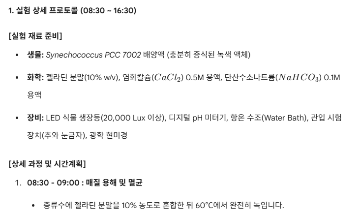
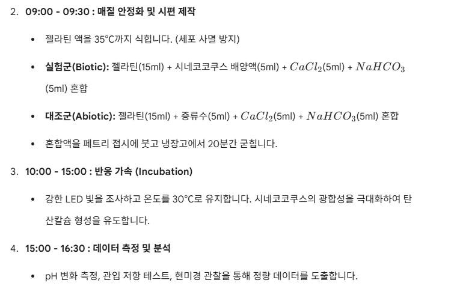

# Synechococcus PCC 7002를 활용한 탄산칼슘 바이오미네랄 형성과 친환경 건축재료 가능성 탐구

## 연구자 정보

학교: 온양고등학교  
학년: 3학년  
이름: 임운택  
희망 진로: 건축학, 건축공학  
활동 분야: 자율 활동  

## 연구기간

2026년 5월

## 연구키워드

Synechococcus PCC 7002, 탄산칼슘, 바이오미네랄화, 바이오시멘트, 친환경 건축재료, 탄소 저감

## I. 서론

### 연구 배경 및 목적

건축 재료는 구조물을 지탱하는 기능뿐 아니라 환경 부담과도 밀접하게 관련된다. 특히 시멘트와 콘크리트는 현대 건축에서 가장 널리 쓰이는 재료이지만, 생산 과정에서 많은 에너지를 사용하고 이산화탄소 배출도 발생한다. 건축학과 건축공학 분야에서는 구조적 안정성, 시공성, 경제성에 더해 탄소 배출을 줄일 수 있는 재료 기술을 함께 검토해야 한다. 이 점에서 생명체의 반응을 활용해 광물질을 만들거나 재료의 강도를 높이는 바이오 기반 건축재료는 앞으로 더 깊이 탐구할 가치가 있다.

이번 활동에서는 광합성 남세균인 Synechococcus PCC 7002와 젤라틴 비드를 이용하여 탄산칼슘 형성을 유도하는 실험 과정을 설계하였다. 실험군에는 젤라틴, Synechococcus 배양액, 염화칼슘, 탄산수소나트륨을 함께 넣고, 대조군에는 Synechococcus 배양액 대신 증류수를 넣어 생물학적 요인의 영향을 비교하도록 구성하였다. LED 빛과 30도 조건을 유지한 뒤 pH 변화, 관입 저항, 현미경 관찰을 통해 탄산칼슘 형성 가능성을 확인하는 방식이다.

연구 목적은 세 가지이다. 첫째, Synechococcus의 광합성 활동과 주변 pH 변화가 탄산칼슘 침전에 어떤 조건을 제공하는지 이해한다. 둘째, 실험군과 대조군을 비교하여 생물학적 반응이 젤라틴 비드의 고결화에 관여할 가능성을 검토한다. 셋째, 이 실험을 바이오시멘트와 자기치유 콘크리트 같은 친환경 건축재료의 원리와 관련지어 건축공학적 활용 가능성을 생각해 본다.

### 연구 동향 및 주요 결과

미생물 유도 탄산칼슘 침전은 지반과 건설재료 분야에서 꾸준히 연구되고 있다. 미생물의 대사 과정이 탄산 이온을 만들고, 이 탄산 이온이 칼슘 이온과 만나 탄산칼슘 결정을 형성하면 흙 입자나 균열 사이를 메우는 효과가 나타날 수 있다. 국내 지반공학 분야에서도 미생물 반응으로 생성된 탄산칼슘이 모래나 실트의 고결화에 영향을 주는지 분석한 연구가 보고되어 있다.

자기치유 콘크리트 연구에서는 균열 내부에 미생물과 칼슘원을 함께 배치해 두었다가, 물이 들어오면 미생물 반응으로 탄산칼슘이 생기도록 하는 방식이 검토된다. 이때 생성된 탄산칼슘은 균열부를 채워 물의 침투를 줄이고 내구성 향상에 기여할 수 있다. 최근에는 콘크리트 안에서 미생물을 보호하기 위한 고분자 비드 담체 연구도 이루어지고 있어, 이번 실험의 젤라틴 비드 방식과 비교해 볼 만하다.

또한 광합성 남세균을 투수 콘크리트 표면에 적용하여 이산화탄소를 광물 형태로 저장하려는 연구도 있다. 남세균은 빛을 이용해 이산화탄소를 고정하고 주변 화학 환경을 바꾸므로, 탄산칼슘 형성과 탄소 저감형 건축재료 연구를 함께 다룰 수 있다. 이번 실험은 대규모 건축재료 실험은 아니지만, 생물의 광합성과 무기물 침전 반응이 재료의 물성 변화로 이어질 수 있다는 점을 작은 규모에서 확인하려는 시도라고 볼 수 있다.

### 배경 이론

Synechococcus PCC 7002는 광합성을 하는 남세균이다. 빛이 공급되면 이산화탄소를 이용해 유기물을 만들고, 이 과정에서 주변의 탄소 화학 평형과 pH가 달라질 수 있다. 물속에서는 이산화탄소, 탄산수소 이온, 탄산 이온이 서로 전환되는데, pH가 높아질수록 탄산 이온의 비율이 증가한다. 탄산 이온이 충분하고 칼슘 이온이 함께 있으면 탄산칼슘이 침전될 수 있다.

이번 실험에서 염화칼슘은 칼슘 이온 공급원이고, 탄산수소나트륨은 탄산계 물질을 제공하는 역할을 한다. Synechococcus가 들어간 실험군에서는 광합성으로 인해 주변 pH가 변하고, 세포 표면이나 젤라틴 매트릭스가 결정 생성 위치로 작용할 가능성이 있다. 반면 대조군은 같은 양의 젤라틴, 염화칼슘, 탄산수소나트륨을 넣되 생물을 제외하므로, 생물학적 작용 없이 화학적 침전만 일어나는 조건을 확인할 수 있다.

젤라틴 비드는 세포를 일정한 위치에 붙잡아 두는 담체 역할을 한다. 실제 자기치유 콘크리트 연구에서도 미생물을 그대로 콘크리트 내부에 넣기 어렵기 때문에, 고분자 비드나 캡슐을 이용해 미생물을 보호하는 방법이 검토된다. 이번 실험에서는 젤라틴 비드가 Synechococcus를 보호하고, 동시에 탄산칼슘이 생길 수 있는 공간을 제공하는지 관찰하는 데 의의가 있다.

### 교과 내용의 한계

화학에서 다루는 침전 반응은 탄산칼슘 형성을 이해하는 출발점이 되었다. 칼슘 이온과 탄산 이온이 만나 고체 침전물을 만든다는 점은 이번 실험의 기본 원리와 맞닿아 있다. 그러나 교과 수준의 침전 반응만으로는 Synechococcus가 있는 조건과 없는 조건의 차이를 충분히 설명하기 어렵다. 실제 반응에서는 pH 변화, 광합성 속도, 세포 표면의 작용, 젤라틴 비드 내부의 확산 정도가 함께 영향을 주기 때문이다.

생명과학에서 배운 광합성 개념도 실험을 이해하는 데 도움이 되었다. Synechococcus는 빛을 이용해 이산화탄소를 흡수하고 주변 환경을 변화시킬 수 있다. 그러나 교과서에서 광합성은 주로 유기물 합성과 산소 발생 과정으로 설명되므로, 그 결과가 탄산칼슘 침전이나 건축재료의 고결화로 이어지는 과정을 직접 설명하기에는 범위가 좁다. 이 때문에 광합성에 따른 pH 변화와 탄산계 평형을 함께 고려해야 한다고 판단하였다.

건축공학적 관점에서도 교과 지식만으로는 한계가 있다. 학교에서 다루는 재료의 강도나 구조 안정성은 주로 하중과 변형의 관계로 설명되지만, 바이오 기반 재료는 미생물의 생존성, 반응 시간, 공극 내부 이동, 장기 내구성까지 함께 검토해야 한다. 따라서 이번 탐구에서는 교과 개념을 바탕으로 하되, 생명체의 대사 작용과 재료 내부의 미세 구조를 추가로 고려하는 방향으로 문제의식을 확장하였다.

## II. 연구 방법

### 0. 실험 준비물

- 생물: Synechococcus PCC 7002 배양액
- 화학 재료: 젤라틴 분말, 염화칼슘 0.5 M 용액, 탄산수소나트륨 0.1 M 용액
- 장비: LED 식물 생장등, 디지털 pH 미터, 항온 수조, 관입 시험 장치, 광학 현미경
- 첨부 사진: 실험 프로토콜 사진 2장

### 1. 가설 설정

#### 연구 질문

Synechococcus PCC 7002가 포함된 젤라틴 비드는 같은 화학 조건의 대조군보다 탄산칼슘 형성과 고결화 정도가 더 뚜렷하게 나타나는가?

#### 가설

Synechococcus PCC 7002가 포함된 실험군은 광합성에 의해 주변 pH와 탄산계 평형이 변하고, 세포와 젤라틴 비드 표면이 결정 생성 위치로 작용하므로 대조군보다 탄산칼슘 침전과 비드의 강도 변화가 더 크게 나타날 것이다.

#### 가설의 근거

탄산칼슘은 칼슘 이온과 탄산 이온이 결합할 때 생성된다. 실험에는 염화칼슘과 탄산수소나트륨이 모두 포함되어 있으므로 화학적 침전 조건은 기본적으로 마련되어 있다. 여기에 Synechococcus의 광합성이 더해지면 이산화탄소 이용과 pH 변화가 일어나 탄산칼슘 침전에 유리한 환경이 만들어질 수 있다. 또한 세포 표면과 젤라틴 비드 내부는 결정이 처음 생기는 자리를 제공할 수 있다. 따라서 생물학적 요인이 있는 실험군과 없는 대조군 사이에 차이가 나타날 가능성이 있다.

### 2. 실험 과정 및 결과

#### 실험 과정

1. 젤라틴 분말을 증류수에 10% 농도로 섞고 60도에서 완전히 녹인다.
2. 젤라틴 용액을 35도까지 식혀 Synechococcus 세포가 열에 의해 손상되지 않도록 한다.
3. 실험군은 젤라틴 15 mL, Synechococcus 배양액 5 mL, 염화칼슘 5 mL, 탄산수소나트륨 5 mL를 혼합한다.
4. 대조군은 젤라틴 15 mL, 증류수 5 mL, 염화칼슘 5 mL, 탄산수소나트륨 5 mL를 혼합한다.
5. 혼합물을 페트리 접시에 붓고 냉장고에서 20분간 굳힌다.
6. LED 빛을 조사하고 온도는 30도로 유지하여 반응을 촉진한다.
7. 일정 시간 뒤 pH 변화, 관입 저항, 현미경 관찰을 통해 실험군과 대조군을 비교한다.

#### 실험 설계의 비교 구조

| 구분 | 실험군 | 대조군 |
|---|---|---|
| 젤라틴 | 15 mL | 15 mL |
| 생물학적 요인 | Synechococcus 배양액 5 mL | 증류수 5 mL |
| 칼슘 공급원 | CaCl2 5 mL | CaCl2 5 mL |
| 탄산계 공급원 | NaHCO3 5 mL | NaHCO3 5 mL |
| 빛 조건 | LED 조사 | LED 조사 |
| 온도 | 30도 | 30도 |
| 비교 목적 | 생물학적 작용 포함 | 생물학적 작용 제외 |

#### 결과 분석 방법

pH 측정은 반응 전후의 산염기 환경 변화를 확인하기 위해 사용한다. 실험군에서 pH 변화가 대조군과 다르게 나타난다면 Synechococcus의 광합성 활동이 반응 환경에 영향을 주었을 가능성을 검토할 수 있다. 관입 저항 테스트는 젤라틴 비드가 얼마나 단단해졌는지 확인하는 방법이다. 탄산칼슘 침전이 비드 내부나 표면에 형성되면 관입 저항이 증가할 가능성이 있다.

현미경 관찰은 결정 형성 여부를 확인하는 데 필요하다. 탄산칼슘 결정은 불규칙한 입자나 밝은 침전 형태로 관찰될 수 있으며, 실험군과 대조군의 표면 구조 차이를 비교하는 데 활용할 수 있다. 다만 이번 활동에서는 실제 측정값이 제공되지 않았으므로, 최종 결과 표에는 실험 중 확보한 pH, 관입 저항, 현미경 사진을 추가해야 한다.

#### 연구 결과

제공된 자료에는 실험 프로토콜과 관찰 계획이 제시되어 있으며, 실제 측정 수치와 현미경 사진은 포함되어 있지 않다. 따라서 본 보고서에서는 실험 설계에 따라 확인해야 할 결과 항목을 정리하고, 결과 해석의 방향을 제시하였다.

| 관찰 항목 | 실험군에서 확인할 점 | 대조군에서 확인할 점 | 해석 방향 |
|---|---|---|---|
| pH 변화 | 광합성에 따른 pH 변화가 나타나는지 확인 | 화학 반응만으로 pH가 변하는지 확인 | 두 조건의 차이가 크면 생물학적 작용 가능성 검토 |
| 관입 저항 | 비드가 더 단단해졌는지 확인 | 젤라틴 자체의 강도 변화 확인 | 실험군의 저항 증가가 크면 침전 또는 구조 변화 가능성 |
| 현미경 관찰 | 세포 주변이나 비드 표면의 침전 관찰 | 무생물 조건의 침전 형태 관찰 | 결정의 양과 위치 차이를 비교 |
| 사진 기록 | 실험 진행 과정과 시료 상태 기록 | 같은 조건으로 기록 | 보고서에 과정 이미지로 첨부 |

결과를 해석할 때 가장 중요한 부분은 실험군과 대조군의 차이다. 두 조건 모두 염화칼슘과 탄산수소나트륨을 포함하므로 화학적 침전은 어느 정도 일어날 수 있다. 그러나 실험군에서 pH 변화, 표면 침전, 관입 저항 증가가 더 뚜렷하게 나타난다면 Synechococcus가 탄산칼슘 형성 환경을 조절했을 가능성을 제시할 수 있다. 반대로 두 조건의 차이가 작다면 생물학적 영향보다 화학적 침전 조건이 더 크게 작용했거나, 반응 시간이 충분하지 않았을 가능성을 검토해야 한다.

건축공학 관점에서는 이 결과가 바이오시멘트와 자기치유 콘크리트의 원리를 이해하는 데 도움이 된다. 미생물이나 남세균이 직접 구조재가 되는 것은 아니지만, 이들이 만든 탄산칼슘이 공극이나 균열을 채운다면 재료의 내구성 향상에 기여할 수 있다. 특히 기존 시멘트 사용량을 줄이거나 균열 보수 과정에서 추가적인 재료 투입을 줄이는 방향으로 발전할 가능성이 있다.

### 3. 실험 시 고려 사항

#### 변인 통제 및 실험 환경 설정

| 구분 | 내용 |
|---|---|
| 독립변인 | Synechococcus PCC 7002 배양액의 포함 여부 |
| 종속변인 | pH 변화, 관입 저항, 현미경상 탄산칼슘 침전 정도 |
| 통제변인 | 젤라틴 농도, CaCl2 양, NaHCO3 양, 반응 온도, LED 조사 조건, 냉장 고화 시간 |
| 오차 요인 | 세포 농도 차이, 젤라틴 혼합 균일도, 온도 편차, pH 미터 보정 상태, 관입 장치의 압력 차이 |

#### 해석할 때 주의할 점

이번 실험은 소형 페트리 접시와 젤라틴 비드를 이용한 모형 실험이다. 따라서 결과가 바로 콘크리트 구조물의 강도 향상으로 이어진다고 말할 수는 없다. 실제 건축재료에 적용하려면 시멘트 수화 반응, 알칼리성 환경에서의 미생물 생존성, 장기 내구성, 물 침투 조건, 균열 폭과 같은 요소를 추가로 검증해야 한다. 그러나 작은 규모의 실험을 통해 탄산칼슘 형성 조건과 생물학적 요인의 차이를 비교한다는 점에서 건축재료 연구의 출발점으로 활용할 수 있다.

## III. 결론

### 연구 결과 요약

이번 활동은 Synechococcus PCC 7002를 포함한 젤라틴 비드가 탄산칼슘 형성에 어떤 영향을 줄 수 있는지 탐구하기 위한 실험 설계와 분석 과정이었다. 실험군과 대조군은 생물학적 요인의 포함 여부만 다르게 구성되었기 때문에, pH 변화와 관입 저항, 현미경 관찰 결과를 비교하면 Synechococcus의 작용을 판단할 수 있다.

탐구를 통해 건축재료의 성능이 화학 반응만으로 결정되는 것이 아니라 생물학적 반응, 미세 구조, 환경 조건과도 관련될 수 있음을 알게 되었다. 건축학과 건축공학에서는 구조물의 형태와 공간을 설계하는 능력뿐 아니라, 그 구조물을 이루는 재료가 어떤 방식으로 만들어지고 오래 유지되는지도 중요하다. 이번 실험은 남세균의 광합성과 탄산칼슘 침전이라는 생명과학적 현상을 친환경 건축재료의 가능성과 함께 해석했다는 점에서 진로와도 맞닿아 있다.

### 한계점 및 피드백

이번 실험 설계의 가장 큰 한계는 정량 결과가 아직 확보되지 않았다는 점이다. pH 변화, 관입 저항, 현미경 관찰 사진이 실제 수치와 이미지로 정리되어야 실험군과 대조군의 차이를 분명하게 판단할 수 있다. 현재 자료만으로는 Synechococcus가 탄산칼슘 형성에 관여할 가능성을 제시할 수는 있지만, 그 정도를 확정하기는 어렵다.

또한 젤라틴 비드는 실험실에서 다루기 쉬운 담체이지만 실제 콘크리트 내부 환경과는 다르다. 콘크리트는 높은 알칼리성, 건조와 습윤 반복, 하중 작용, 공극 구조의 차이를 가지므로 남세균이 같은 방식으로 작용한다고 바로 판단할 수 없다. 후속 연구에서는 모르타르나 다공성 콘크리트 시편을 활용하여 균열 보수 효과와 강도 변화를 함께 확인해야 한다.

오차 요인으로는 세포 농도의 차이, 젤라틴 혼합 정도, LED 빛의 세기, 온도 유지 상태, pH 미터의 보정 여부가 있다. 특히 관입 저항은 측정자가 누르는 속도와 방향에 따라 값이 달라질 수 있으므로 같은 장비와 같은 방법으로 반복 측정해야 한다. 이러한 한계를 보완하면 바이오 기반 건축재료의 가능성을 더 신뢰성 있게 평가할 수 있을 것이다.

### 후속 연구

후속 연구에서는 Synechococcus 기반 젤라틴 비드를 실제 건축재료 모형에 적용해 보고 싶다. 예를 들어 작은 모르타르 시편이나 다공성 콘크리트 조각에 균열을 만들고, 남세균 비드와 칼슘원을 넣은 뒤 균열 폭이 줄어드는지 관찰할 수 있다. 이때 육안 관찰에 그치지 않고 물 흡수율, 압축강도, 표면 경도 같은 재료공학적 지표를 함께 측정하면 건축공학적 해석이 더 분명해질 것이다.

또한 빛의 세기와 반응 시간이 탄산칼슘 형성에 미치는 영향도 비교하고 싶다. 남세균은 광합성을 하므로 LED 세기나 조사 시간이 반응에 영향을 줄 가능성이 있다. 건축물 외피나 실내 마감재에 적용하려면 빛이 충분한 곳과 부족한 곳에서 반응 차이가 생길 수 있기 때문이다. 이러한 조건을 분석하면 생물 기반 재료가 실제 건축 환경에서 사용되기 위해 필요한 조건을 더 구체적으로 판단할 수 있다.

## IV. 참고문헌

- 한국건설기술연구원·KAIST, 「친환경 바이오 신소재를 이용한 고강도 지반건설 재료 및 공법」.
- 한국지반공학회논문집, 「Bacteria를 이용한 실트와 모래의 고결화에 따른 탄산칼슘 확인」.
- DBpia, 「광합성 남세균을 도포한 투수 콘크리트의 이산화탄소 고정에 의한 물성 변화」.
- DBpia, 「미생물 기반 콘크리트 자기치유를 위한 미생물 담체 최적화 및 균열치유성능 분석」.
- 노션 첨부자료, `IMG_2996.png`, `IMG_2997.png`, `TalkFile_[실험] AFE 실험보고서(양식, 2026).hwp`.

## 작성자 검토 메모

- HWP 양식 위계에 맞춰 `배경 이론`, `교과 내용의 한계`는 `서론` 하위 항목으로 배치했다.
- `후속 연구`는 `결론` 하위 항목으로 배치했다.
- `연구 방법`은 `0. 실험 준비물`, `1. 가설 설정`, `2. 실험 과정 및 결과`, `3. 실험 시 고려 사항` 순서로 재배치했다.
- 실제 pH 값, 관입 저항 수치, 현미경 사진이 제공되면 `2. 실험 과정 및 결과` 안의 연구 결과 표를 정량 결과 중심으로 보완해야 한다.
